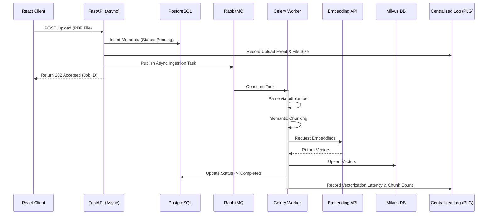
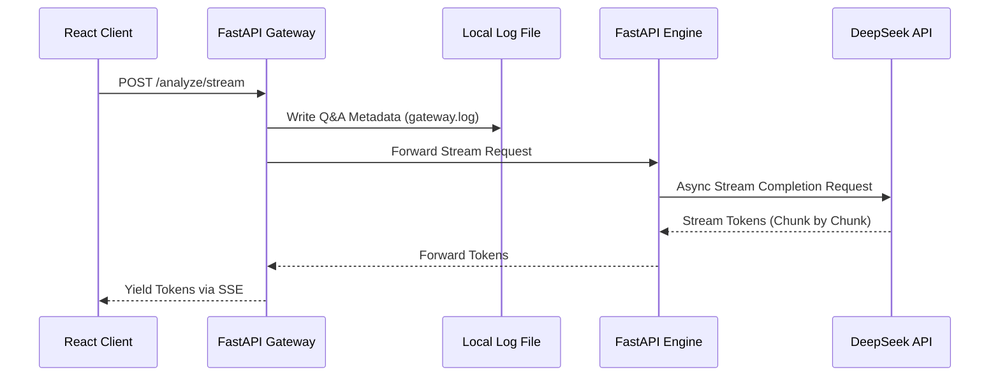
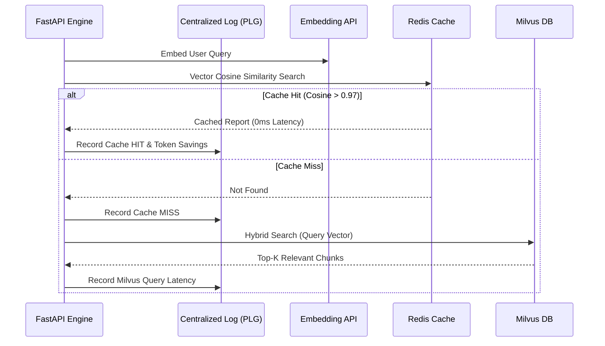
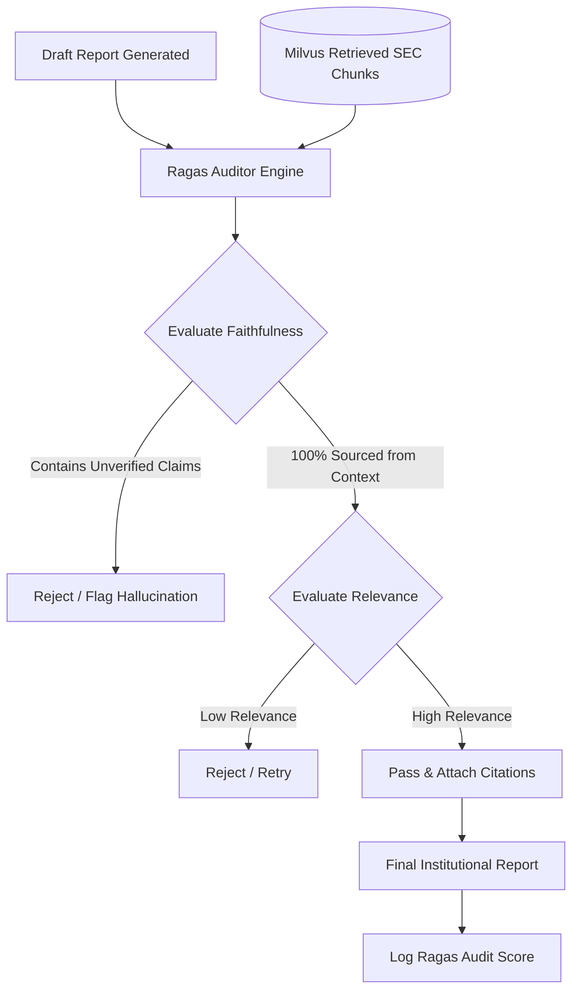
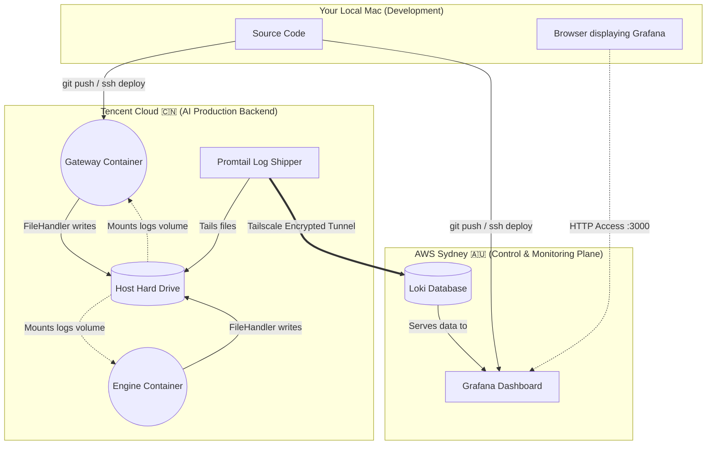

<div align="right">
  <a href="README.md"></a>
  <a href="README_zh.md"></a>
</div>

# 📊 JL Intelligence - Enterprise AI Analyst (Microservices Architecture)

> AI-powered SEC financial analysis tool for institutional investors. Built with a production-ready microservices architecture, emphasizing **100% asynchronous concurrency**, multi-modal database optimization, and strict Ragas objective auditing.

**Live Demo:** [JL Intelligence (Tencent Enterprise Server)](http://43.129.249.161/)
**Core Stack:** React · FastAPI · Milvus · Redis · Celery/RabbitMQ · DeepSeek / Gemini

---

## 🔹 1. Enterprise Microservices Architecture & Tech Stack

Our system is decoupled into specialized microservices, avoiding monolithic bottlenecks. Every I/O operation—from document ingestion to LLM token streaming—is designed to be fully **asynchronous** to maximize concurrency.

### Core Tech Stack:
- **API Gateway & Core Engine**: FastAPI (Python 3.10) - utilizing `async`/`await` for non-blocking I/O.
- **Document Parsing Strategy**: We evaluated heavy OCR AI models (like **Docling**), but rejected them because they were prohibitively slow, models were too large, and they consumed excessive CPU/RAM. Instead, we actively selected **`pdfplumber`** for its lightning-fast, resource-efficient, and highly precise extraction of SEC financial tables.
- **Message Broker & Workers**: RabbitMQ & Celery (for distributing parsing tasks).
- **Databases**:
  - **PostgreSQL**: Relational metadata and document state tracking.
  - **Milvus (Standalone)**: High-dimensional vector storage.
  - **Redis**: In-memory semantic caching and task state management.
- **AI Models & Orchestration (Decoupled Intelligence)**: 
  We strategically decouple the AI workloads into two distinct phases, utilizing different models optimized for each specific task based on our codebase implementation:
  
  1. **Phase 1: Embedding & Vectorization (User Queries & SEC Data)**
     - *Role*: This phase is responsible for converting massive text chunks from SEC documents into dense vectors during ingestion, as well as embedding the user's question during the hybrid search process. 
     - *Primary Model*: **OpenAINext (`text-embedding-3-small`)**. Chosen specifically for its high-granularity output (**1536 dimensions**). Compared to Gemini's 768 dimensions, this higher dimensionality provides significantly greater precision during semantic retrieval. (Note: DeepSeek is not used here as it lacks native embedding endpoints in our setup).
     - *Fallback Model*: **Gemini Embeddings** (768 dimensions). If the OpenAINext API experiences rate limiting or downtime, the system seamlessly falls back to Gemini to ensure zero interruption.
  
  2. **Phase 2: Generation & Reasoning (Inference)**
     - *Role*: After retrieving the most relevant contexts from the Milvus vector database, this phase is responsible for synthesizing the data and streaming the final analytical report back to the user.
     - *Primary Model*: **DeepSeek-Chat**. Selected because it is exceptionally cost-effective and fast for heavy reasoning tasks. Gemini, by contrast, is significantly more expensive, blocks Hong Kong servers, and exhibits higher latency.
     - *Fallback Model*: **Gemini 2.5 Pro**. If DeepSeek's API crashes (HTTP 500) or is throttled (HTTP 429), our LLM Cascade mechanism dynamically routes the streaming request to Gemini to guarantee high availability.

  - **Orchestration**: Custom LangChain-style async pipelines with LangGraph-inspired routing loops. Enables complex, cyclic routing loops for the Ragas auditor.

---

## 🔹 2. The Asynchronous Data Pipeline (Concurrency & Speed)

To handle massive enterprise workloads, both the **Input (Ingestion)** and **Output (Inference)** pipelines are completely asynchronous.

### 2.1 Async Input: Document Ingestion & Vectorization Flow
When a massive 200-page SEC 10-K report is uploaded, the API does not block. It registers the job in PostgreSQL and delegates the vectorization to the Celery Worker cluster via RabbitMQ. 



### 2.2 Async Output: Streaming Inference Flow
Instead of waiting 30 seconds for a full financial report, the Engine utilizes Python's asynchronous generators (`async yield`) to push tokens to the React frontend via **Server-Sent Events (SSE)**. 



---

## 🔹 3. High Availability, Fallbacks & Multi-Cloud Networking

### Microservices Monitoring & LLM Cascade
Microservices constantly monitor API health. If the primary `DeepSeek-Chat` endpoint hits a rate limit (HTTP 429) or crashes, the system triggers an **LLM Cascade Fallback** to `Gemini 2.5 Flash / Pro`.
- **Why Gemini?** Gemini provides an exceptional balance of cost-efficiency and high throughput for fallback scenarios, ensuring RPO/RTO resilience without drastically spiking emergency API costs.

### Multi-Cloud Networking & Proxy Elimination (TCO Strategy)
Due to Gemini API's strict regional blocking in Hong Kong, the initial architecture relied on a brittle SOCKS5 proxy tunnel routing all LLM requests through an AWS Sydney EC2 instance. This drastically increased latency.
- **Solution:** The stateless `engine` and `gateway` containers were permanently migrated to an AWS Sydney environment, natively bypassing regional API blocks and eliminating the proxy layer overhead, reducing API latency by over **50%**.

---

## 🔹 4. Database Architecture (Optimization & Synergies)

We utilize a combination of purpose-built databases rather than forcing a single monolith DB to handle all workloads. This prevents locking and ensures specific bottlenecks are handled optimally:

| Component | Technology | Primary Role | Why we chose it (vs Alternatives) | Optimization Strategy |
| :--- | :--- | :--- | :--- | :--- |
| **Relational Metadata** | **PostgreSQL** | Store document metadata, chunk mapping, and ingestion status. | Chosen over NoSQL (MongoDB) for strict ACID transactional guarantees when tracking financial document state. | Implemented **PgBouncer** connection pooling. B-Tree indexing verified via `EXPLAIN ANALYZE`. |
| **Vector Store** | **Milvus** (Standalone) | Store and search chunked high-dimensional dense vectors. | Chosen over `pgvector` because standalone Milvus scales infinitely better for millions of vectors, supporting advanced ANN (HNSW) indexing. | Isolated in a private subnet, scaled independently of metadata DB. |
| **In-Memory Cache** | **Redis** | Semantic caching and Celery message broker backend. | Chosen over Memcached due to persistence features and support for complex data structures required by Celery. | Compute cosine similarity of queries. Cache hits (>0.97) bypass LLM layer for 0ms response. |



---

## 🔹 5. Objective Auditing with Ragas (Hallucination Prevention)

In the financial sector, hallucinations are unacceptable. We have integrated **Ragas (Retrieval Augmented Generation Assessment)** directly into our CI/CD pipeline as a mandatory **Quality Gate** before any deployment.

### Automated CI/CD Quality Gate Workflow
During the GitHub Actions pipeline, the system spins up a localized Docker environment and executes `run_eval.py`. It simulates deterministic institutional queries (e.g., *“Provide a comprehensive memo analyzing core business transformation, portfolio risks, and PFIC tax compliance.”*).

The Ragas Auditor acts as a strict judge, comparing the LLM's generated draft against the original SEC text chunks retrieved from Milvus. It enforces hard quantitative thresholds:
1. **Faithfulness (Required > 0.85)**: Ensures the generated report is strictly derived from the retrieved context. If the LLM hallucinates unverified numbers, the score drops, and the CI build **fails immediately**.
2. **Context Precision (Required > 0.75)**: Ensures the retrieved Milvus chunks actually contain the necessary facts to answer the specific financial query.
3. **Answer Relevance**: Ensures the response does not deviate into unrelated topics.

Only if all quantitative thresholds are passed will the pipeline proceed to push to the Tencent Cloud production server.



---

## 🔹 6. DevOps, Observability & Disaster Recovery

The system runs on a containerized environment deployed via automated CI/CD pipelines.

### GitOps & Zero-Downtime Hot Reloads
- **Automated Deployment**: `git push` triggers GitHub Actions which runs `pytest` integration tests. Upon success, Docker images are built and pushed to the Container Registry. The remote server automatically pulls images and executes the deployment.
- **Zero-Downtime Rolling Updates**: The custom `deploy.sh` script applies rolling updates specifically to stateless containers (`gateway`, `engine`), intentionally preserving stateful volumes (`postgres`, `milvus`, `redis`) to prevent enterprise data corruption.

### AIOps & Full-Stack Observability (Prometheus + Grafana)
We implement AIOps-level monitoring using **Prometheus** to scrape FastAPI `/metrics` in real-time, visualized via **Grafana** dashboards.
- **Metrics Tracked**: LLM Token Consumption, API Latency (P99), Rate Limit (HTTP 429) spikes, and Redis cache hit ratios.
- **AIOps Self-Healing**: Instead of manual intervention, our monitoring layer seamlessly interfaces with the LLM Cascade Fallback mechanism. If DeepSeek latency spikes or fails, the system automatically routes traffic to Gemini, achieving zero-downtime self-healing.

### Disaster Recovery (Pilot Light IaC) & Chaos Engineering
To guarantee enterprise-grade resilience while minimizing Total Cost of Ownership (TCO), we implemented a **Pilot Light** disaster recovery strategy managed by Infrastructure as Code (IaC).
- **RPO (Recovery Point Objective) < 15 mins**: All stateful data (PostgreSQL, Milvus) is continuously backed up via asynchronous cross-region snapshots to a cold S3 bucket.
- **RTO (Recovery Time Objective) < 10 mins**: If the primary environment suffers a catastrophic failure, our pre-configured `terraform` blueprint is executed to instantly provision a fresh AWS EC2 cluster, pull docker images, and restore state.

To prevent "Configuration Drift" in this DR strategy, we implemented automated Chaos Engineering drills:
- **Weekly Fire Drills**: A GitHub Actions workflow (`dr_game_day.yml`) runs every Sunday at 3:00 AM. It automatically SSHs into our AWS Standby server, spins up the entire Docker cluster, and runs the Ragas end-to-end evaluation to ensure IaC readiness.

---

---

## 🔹 8. Zero-Trust PLG Monitoring Architecture

To ensure 100% observability and strict data security across our multi-cloud deployment, we implemented a **Promtail + Loki + Grafana (PLG)** stack secured via a **Tailscale** overlay network.

### Multi-Cloud Log Topology
- **Data Generator (Tencent Cloud)**: The `Gateway` and `Engine` microservices log all analytical queries and health metrics dynamically to host volumes (`/home/ubuntu/AI_Stock_Analyst_Enterprise/logs/`).
- **Data Shipper**: `Promtail` runs alongside the application, trailing `gateway.log` and `engine.log`.
- **Zero-Trust Tunnel**: Instead of exposing our logging database to the public internet, Promtail pushes logs through a military-grade encrypted **Tailscale VPN** directly to the Control Plane.
- **Control Plane (AWS Sydney)**: The `Loki` database securely receives and indexes the logs. `Grafana` visualizes this data in real-time, providing an unadulterated "Live AI Q&A Log" stream by filtering specifically for `Gateway streaming:` queries.



---

## 🔹 9. Security & Secret Management

Enterprise financial applications require strict secret management. API keys (Gemini, DeepSeek, OpenAINext) and database credentials are **never** hardcoded into the repository.

| Environment | Secret Management Strategy |
| :--- | :--- |
| **Local Development** | Injected via local `.env` files (ignored by `.gitignore`). |
| **CI/CD Pipeline** | Managed securely via **GitHub Secrets** during GitHub Actions execution. |
| **Production** | Managed via Cloud Key Management Service (KMS) or injected as secure runtime environment variables into the Tencent/AWS container environment. |

---

## 🚀 Quick Start (Local Docker Deployment)

> [!IMPORTANT]
> This is a private enterprise repository. Please ensure you have been granted repository access by the administrator before attempting to clone.

```bash
# Clone the private repository (requires SSH key or PAT)
git clone git@github.com:joe-ging/AI_Stock_Analyst_Enterprise.git
cd AI_Stock_Analyst_Enterprise

# Create and populate the local secret environment file
touch .env
echo "GEMINI_API_KEY=your_key_here" >> .env
echo "DEEPSEEK_API_KEY=your_key_here" >> .env
echo "OPENAINEXT_API_KEY=your_key_here" >> .env

# Launch entire microservice cluster
docker-compose up -d --build

# View logs
docker-compose logs -f engine worker
```

**Access the Application:** Navigate to `http://localhost:8000/index.html`
