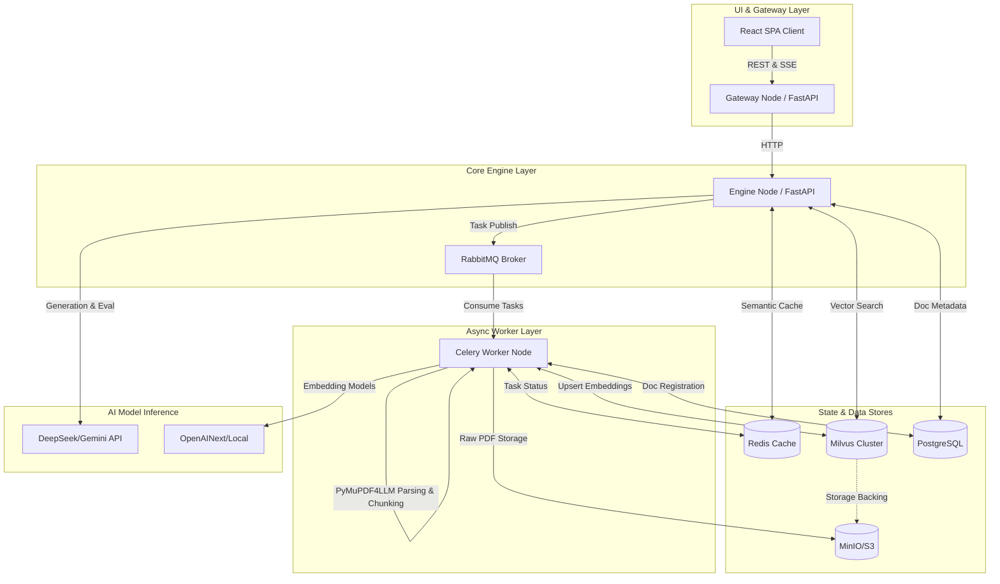
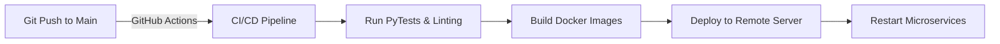

# 📊 JL Intelligence - Enterprise AI Analyst (Microservices Architecture)

> AI-powered SEC financial analysis tool for institutional investors. Built with a production-ready microservices architecture, supporting distributed asynchronous ingestion, multi-modal semantic caching, and strict Ragas objective auditing.

**Live Demo:** [JL Intelligence](https://jl-intelligence.netlify.app/) · **Core Stack:** React · FastAPI · Milvus · Redis · Celery/RabbitMQ · DeepSeek/Gemini

---

## 🔹 Enterprise Microservices Architecture

Unlike a simple monolithic application, this system is decoupled into highly specialized microservices designed for scale, fault tolerance, and async background processing.

### Physical Architecture Diagram



### Microservices Communication & Listening

Our architecture relies on asynchronous event-driven communication rather than blocking HTTP requests:
1. **Gateway Node**: Acts as the reverse proxy and static asset server. It routes client requests (`/analyze`, `/query/stream`) to the internal Engine node and streams Server-Sent Events (SSE) back to the user instantly.
2. **Engine Node**: The brain of the RAG pipeline. When a user uploads a new PDF, the Engine registers it in **PostgreSQL** and publishes an ingestion task to **RabbitMQ**, then begins polling the task status or semantic cache in **Redis**.
3. **Worker Node**: A Celery worker that constantly listens to the **RabbitMQ** queue. When a new PDF arrives, it pulls the file from **MinIO/S3**, extracts text, chunks it, generates embeddings, and inserts them into **Milvus**. It updates the job status in **Redis** and **Postgres** so the Engine knows when it's done.

---

## 🔹 The AI "Long Chain" (End-to-End RAG Pipeline)

We have implemented a highly sophisticated Retrieval-Augmented Generation (RAG) pipeline to ensure institutional-grade accuracy.

### 1. Ingestion & Embedding Pipeline (Async)
- **Intelligent Parsing**: We replaced basic text extraction with `PyMuPDF4LLM` to preserve complex financial tables, markdown formatting, and hierarchical document structures.
- **Semantic Chunking**: Large 10-K/20-F reports (200+ pages) are broken down into overlapping chunks (e.g., 1000 characters with 100 char overlap) and injected with source metadata (`[Source: DAO 2024 Annual Report | Chunk 15]`).
- **Vectorization**: Chunks are embedded using high-dimensional embedding models and persisted into **Milvus HNSW indexes**.

### 2. Retrieval & Semantic Cache (Real-Time)
- **Redis Semantic Cache**: Before any LLM call, the user's query is embedded. We perform a cosine similarity search against previous queries. If similarity is >0.97, the system instantly returns a cached report (0ms LLM latency, 100% cost reduction).
- **Hybrid Retrieval**: On a cache miss, the system fetches the Top-K most relevant chunks from **Milvus** based on the query vector.

### 3. Generation & Objective Auditing (Ragas)
- **Streaming Inference**: The LLM (DeepSeek/Gemini) generates the analytical report, instantly streamed token-by-token to the React frontend.
- **LLM Ticker Resolution**: Supports NLP ticker resolution. "Apple" -> "AAPL", "腾讯" -> "TCEHY" automatically mapped for SEC EDGAR lookup.
- **Ragas Quality Audit**: Once the text generation completes, the system launches a secondary, asynchronous LLM validation loop. It calculates `Faithfulness` (Are the numbers hallucinated?), `Answer Relevancy`, and `Context Recall`.
- **Verified Delivery**: The frontend `Export PDF` button is locked until the Ragas scores and exact citation links (SEC EDGAR URLs) are attached to the payload.

---

## 🔹 DevOps, MLOps & Deployment (CI/CD)

The system is deployed using modern DevOps practices, fully containerized via `docker-compose`.



### CI/CD Workflow
- **Automated Testing**: Every commit triggers a suite of integration tests (e.g., `test_e2e_stream.py`) to validate the core RAG logic.
- **Zero-Downtime Deployment**: The `deploy.sh` script rebuilds modified Docker containers (`gateway`, `engine`, `worker`) and restarts them gracefully without corrupting active Milvus clusters or Postgres metadata.

---

## 🔹 To-Do List & Future Roadmap

To achieve full 99.99% enterprise availability, the following architectural upgrades are scheduled:

- [ ] **Data Backup & Disaster Recovery (灾备与备份)**
  - Implement automated daily snapshots of **PostgreSQL** (pg_dump) and **Milvus** collections.
  - Cross-region replication for the MinIO bucket to prevent data loss.
- [ ] **MLOps & Model Maintenance**
  - Implement a dedicated model registry (e.g., MLflow) to track embedding model versions and LLM prompt iterations.
  - Automate the fine-tuning data flywheel using user-corrected Ragas evaluation failures.
- [ ] **Advanced Monitoring**
  - Integrate Prometheus & Grafana to monitor RabbitMQ queue lengths, Celery worker memory limits, and Redis cache hit rates.
- [ ] **Kubernetes (K8s) Migration**
  - Migrate from `docker-compose` to EKS/GKE with KEDA auto-scaling for the Celery workers during peak earnings seasons.

---

## 🚀 Quick Start (Local Docker Deployment)

```bash
# Clone repository
git clone https://github.com/joe-ging/AI_Stock_Analyst_Enterprise.git
cd AI_Stock_Analyst_Enterprise

# Set environment variables
echo "GEMINI_API_KEY=your_key" >> .env
echo "DEEPSEEK_API_KEY=your_key" >> .env

# Launch entire microservice cluster
docker-compose up -d --build

# View logs
docker-compose logs -f engine worker
```

**Access the Application:** Navigate to `http://localhost:8000/index.html`

---

## 📄 License

MIT
