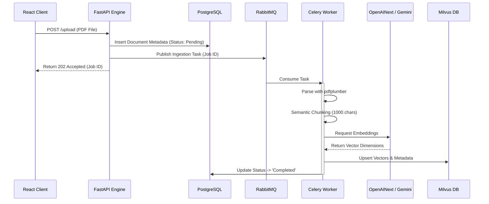
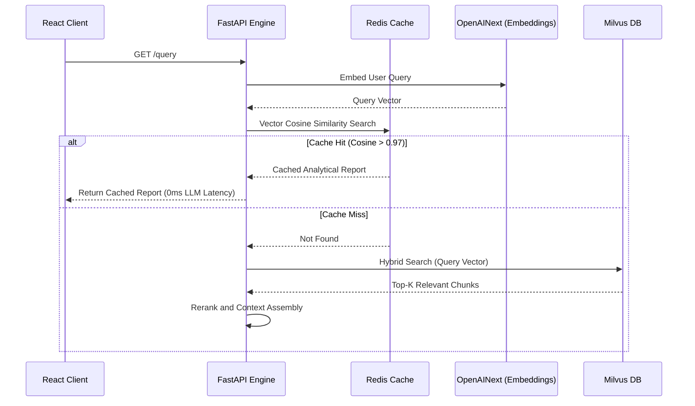
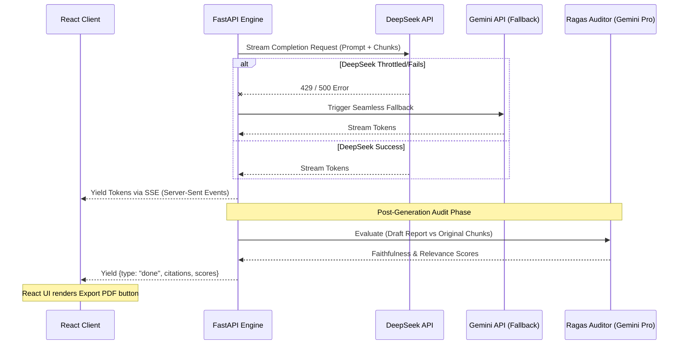

# 📊 JL Intelligence - Enterprise AI Analyst (Microservices Architecture)

> AI-powered SEC financial analysis tool for institutional investors. Built with a production-ready microservices architecture, supporting distributed asynchronous ingestion, multi-modal semantic caching, and strict Ragas objective auditing.

**Live Demo:** [JL Intelligence](https://jl-intelligence.netlify.app/) · **Core Stack:** React · FastAPI · Milvus · Redis · Celery/RabbitMQ · DeepSeek / Gemini / OpenAINext

---

## 🔹 Enterprise Microservices Architecture & Tech Stack

Our system is completely decoupled into specialized microservices, avoiding the bottlenecks of monolithic designs. We utilize an event-driven architecture to handle high-concurrency document processing and low-latency semantic retrieval.

### Core Tech Stack:
- **Frontend**: React (SPA), Tailwind CSS
- **API Gateway & Core Engine**: FastAPI (Python 3.10)
- **Document Parsing**: `pdfplumber` (for precise layout and table extraction)
- **Message Broker**: RabbitMQ
- **Background Workers**: Celery
- **Vector Database**: Milvus (Standalone) backed by MinIO & etcd
- **Relational Database**: PostgreSQL (for document metadata tracking)
- **Caching Layer**: Redis (for Task states and Semantic Caching)
- **AI Models & Orchestration**: 
  - **Generation**: DeepSeek-Chat (Primary) with streaming inference via Server-Sent Events (SSE).
  - **Fallback**: Gemini 2.5 Flash / Pro (Seamless fallback if primary model fails).
  - **Embeddings**: OpenAINext (`text-embedding-3-small`) with Gemini embedding fallback.
  - **Orchestration**: LangChain-style RAG pipelines with custom LangGraph-inspired Auditor routing loops.

---

## 🔹 Microservices Event-Driven Flows (Architecture Diagrams)

The core strength of our physical architecture is how microservices communicate and listen to each other asynchronously. Here are the three primary system flows:

### 1. Asynchronous Ingestion & Vectorization Flow (The Worker Loop)

When a massive 200-page SEC 10-K report is uploaded, the Engine does not block the user's HTTP request. Instead, it registers the job and delegates the heavy lifting to the Celery Worker cluster via RabbitMQ.



### 2. Semantic Caching & Hybrid Retrieval Flow (The Query Loop)

To minimize expensive LLM API calls and drastically reduce latency, the Engine intercepts queries and checks a Redis-backed Semantic Cache before hitting the Vector DB.



### 3. Streaming Inference & Objective Auditing Flow (The Generation Loop)

We implement real-time streaming inference using Server-Sent Events (SSE). Once generation finishes, an isolated Ragas auditing process is launched to ensure institutional compliance.



---

## 🔹 DevOps & CI/CD Pipeline

The system runs on a containerized environment deployed via automated CI/CD pipelines to ensure reliability and Zero-Downtime deployments.

```mermaid
graph LR
    A[Git Push to Main] -->|GitHub Actions| B[CI/CD Pipeline]
    B --> C[Run PyTests & Linting]
    C --> D[Build Docker Images]
    D --> E[Deploy to Remote Server]
    E --> F[Graceful Restart (docker-compose)]
```

### Deployment (DevOps & MLOps Maintenance)
- **Containerization**: Everything runs inside isolated Docker containers managed by `docker-compose`, making horizontal scaling of Celery workers trivial.
- **Automated Testing**: Every push triggers integration tests (e.g., `test_e2e_stream.py`) to validate the RAG retrieval logic and API connectivity.
- **Hot-Reload Deployments**: The deployment script (`deploy.sh`) selectively rebuilds and restarts only the modified application containers (`gateway`, `engine`, `worker`), leaving stateful services (`milvus`, `postgres`, `redis`) untouched to ensure zero data corruption.

---

## 🚀 Quick Start (Local Docker Deployment)

```bash
# Clone repository
git clone https://github.com/joe-ging/AI_Stock_Analyst_Enterprise.git
cd AI_Stock_Analyst_Enterprise

# Set environment variables
echo "GEMINI_API_KEY=your_key" >> .env
echo "DEEPSEEK_API_KEY=your_key" >> .env
echo "OPENAINEXT_API_KEY=your_key" >> .env

# Launch entire microservice cluster
docker-compose up -d --build

# View logs
docker-compose logs -f engine worker
```

**Access the Application:** Navigate to `http://localhost:8000/index.html`

---

## 📄 License

MIT
