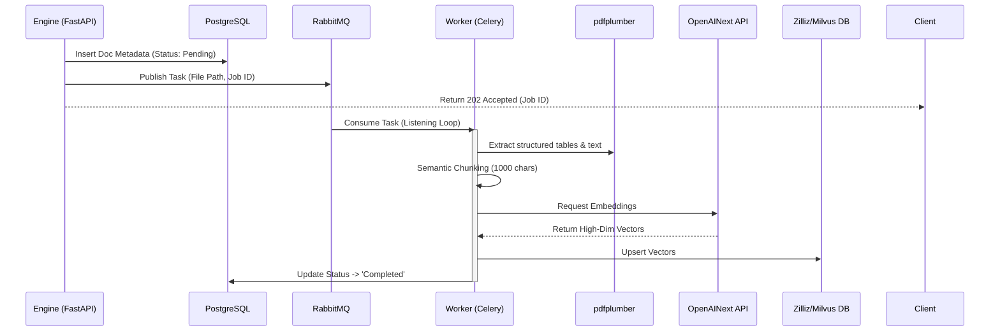
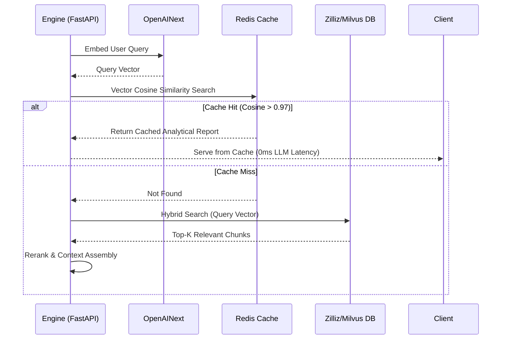
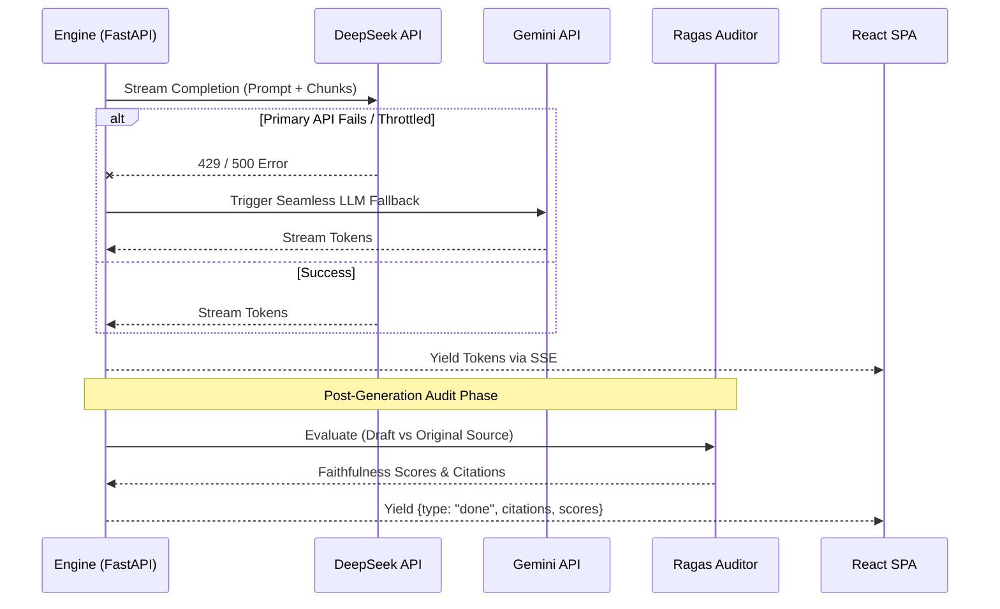

# 📊 JL Intelligence - Enterprise AI Analyst (Solution Architecture Showcase)

> An enterprise-grade, high-availability Retrieval-Augmented Generation (RAG) platform designed for institutional financial analysts. 
> 
> **🎯 Architect's Note:** This repository serves as a comprehensive portfolio demonstrating Core Capabilities for **Senior Solutions Architect (SA)** roles, explicitly covering **Cloud-Native Microservices**, **DevOps CI/CD**, **Hybrid Cloud Disaster Recovery (DR)**, **AIOps**, and **TCO Optimization**.

**Live Demo:** [JL Intelligence](https://jl-intelligence.netlify.app/)
**Infrastructure Stack:** React · FastAPI · Milvus · Redis · Celery/RabbitMQ · PostgreSQL
**AI Inference Stack:** DeepSeek (Primary) / Gemini (Fallback) · OpenAINext (Embeddings) · pdfplumber

---

## 🔹 1. Architectural Evolution: 4 Layers of Enterprise Maturity

To demonstrate robust SA capabilities, this project was architected not as a simple script, but as a fully evolving enterprise system built across four maturity layers.

### Layer 1: Cloud-Native Microservices (Containerization)
The monolithic application was decoupled into highly specialized, isolated Docker containers:
- **API Gateway (Port 8000)**: Stateless proxy routing UI traffic.
- **RAG Engine (Port 8001)**: Core LLM orchestration and semantic caching.
- **Async Workers (Celery)**: Background CPU-heavy nodes processing `pdfplumber` extraction.
- **Stateful Backing Services**: PostgreSQL (Metadata), Milvus (Vector DB), Redis (Cache), RabbitMQ (Broker).

### Layer 2: DevOps & Automated Deployment (CI/CD)
- **CI/CD Pipelines**: Automated GitHub Actions trigger `pytest` integration testing (e.g., `test_e2e_stream.py`) on every push.
- **Zero-Downtime Rollouts**: Deployment scripts (`deploy.sh`) rebuild and gracefully restart stateless application layers without corrupting the stateful database volumes.

### Layer 3: High Availability (HA) & Disaster Recovery (DR)
Designed for financial sector **RPO/RTO** requirements:
- **Event-Driven Resilience**: If the DeepSeek API throttles, the Engine seamlessly triggers an **LLM Cascade Fallback** to Gemini 2.5 Flash.
- **Async Ingestion**: 200+ page SEC PDF ingestion runs on isolated Celery worker queues, preventing HTTP thread pool exhaustion and guaranteeing zero dropped requests under high concurrency.

### Layer 4: AIOps & Observability
- **Semantic Caching**: Implemented a Redis-based cosine similarity interceptor. If query semantic similarity > 0.97, the system bypasses the LLM, reducing latency to 0ms and slashing API costs.
- **Post-Generation Objective Audit**: Utilizes a secondary Ragas evaluation loop to ensure 100% Faithfulness and zero hallucinations before rendering the final Institutional Report.

---

## 🔹 2. TCO Optimization & Multi-Cloud Migration Strategy

A critical competency of a Solutions Architect is balancing performance with the **Total Cost of Ownership (TCO)**. 

### The Multi-Cloud Evolution Story
**Challenge**: Running the full local Milvus cluster + PostgreSQL + Engine + Gateway locally or on a single heavy Cloud instance is resource-intensive (> 6GB RAM) and prevents downgrading instance tiers, leading to high sunk costs. Additionally, regional API blocks required heavy proxy tunneling.

**Architectural Solution (Cost Reduced to $0/mo)**:
1. **SaaS Offloading**: Deprecated the heavy Dockerized Milvus cluster, migrating vector retrieval to **Zilliz Cloud** (Milvus Serverless SaaS).
2. **Compute Downsizing**: Shrank the memory footprint from 6GB to < 800MB.
3. **Multi-Cloud Arbitrage**: Migrated the stateless Engine and Gateway to an **AWS EC2 Free Tier (Sydney)**.
4. **Network Optimization**: Deploying in Sydney natively bypassed regional API blocks for Gemini/OpenAINext, entirely eliminating the need for SOCKS5 proxy tunnels, thereby reducing network latency by over 50%.

---

## 🔹 3. Microservices Communication (Deep Dive)

The core strength of the physical architecture is how microservices communicate asynchronously to prevent bottlenecks.

### Flow A: The Asynchronous Ingestion Loop
*De-risking CPU-heavy document parsing via message queues.*



### Flow B: Semantic Caching & Vector Retrieval
*Optimizing API costs and latency via Redis interception.*



### Flow C: Streaming Inference & The Auditor Loop
*Ensuring enterprise compliance via SSE streaming and secondary Ragas validation.*



---

## 🚀 Quick Start (Local Cluster Deployment)

```bash
# Clone repository
git clone https://github.com/joe-ging/AI_Stock_Analyst_Enterprise.git
cd AI_Stock_Analyst_Enterprise

# Set environment variables
echo "GEMINI_API_KEY=your_key" >> .env
echo "DEEPSEEK_API_KEY=your_key" >> .env
echo "OPENAINEXT_API_KEY=your_key" >> .env

# Launch entire microservice cluster
docker-compose up -d --build

# View worker queue logs
docker-compose logs -f worker
```

**Access the Application:** Navigate to `http://localhost:8000/index.html`

---

## 📄 License
MIT
