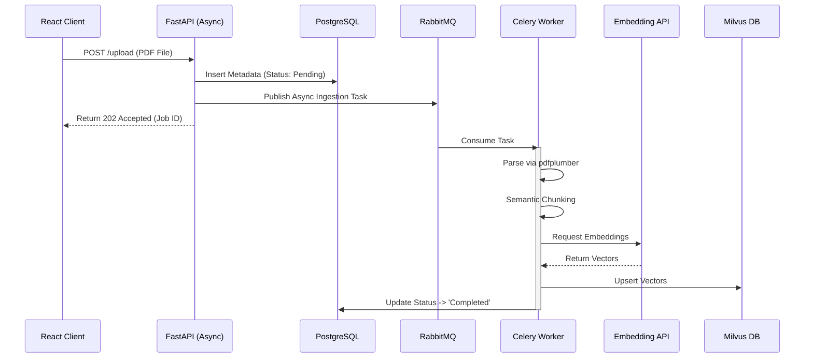
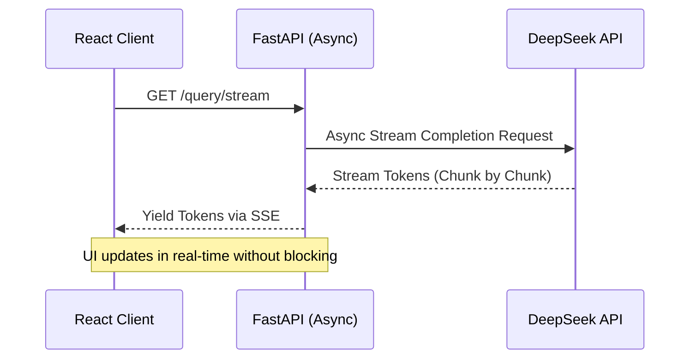
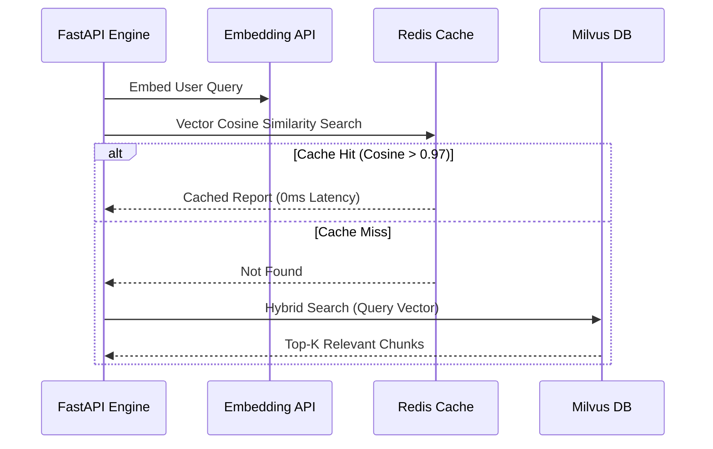
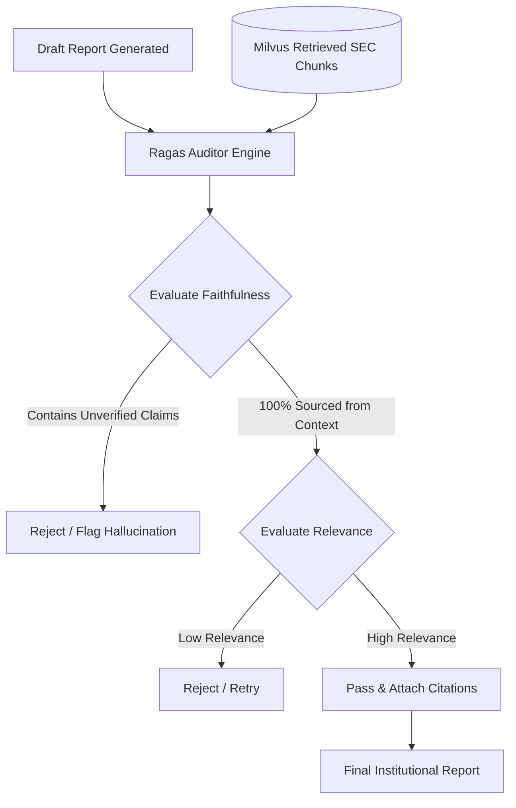

<div align="right">
  <a href="README.md"></a>
  <a href="README_zh.md"></a>
</div>

# 📊 JL Intelligence - Enterprise AI Analyst (Microservices Architecture)

> AI-powered SEC financial analysis tool for institutional investors. Built with a production-ready microservices architecture, emphasizing **100% asynchronous concurrency**, multi-modal database optimization, and strict Ragas objective auditing.

**Live Demo:** [JL Intelligence](https://jl-intelligence.netlify.app/)
**Core Stack:** React · FastAPI · Milvus · Redis · Celery/RabbitMQ · DeepSeek / Gemini

---

## 🔹 1. Enterprise Microservices Architecture & Tech Stack

Our system is decoupled into specialized microservices, avoiding monolithic bottlenecks. Every I/O operation—from document ingestion to LLM token streaming—is designed to be fully **asynchronous** to maximize concurrency.

### Core Tech Stack:
- **API Gateway & Core Engine**: FastAPI (Python 3.10) - utilizing `async`/`await` for non-blocking I/O.
- **Document Parsing**: `pdfplumber` (for precise layout and SEC financial table extraction).
- **Message Broker & Workers**: RabbitMQ & Celery (for distributing CPU-heavy parsing tasks).
- **Polyglot Persistence (Databases)**:
  - **PostgreSQL**: Relational metadata and document state tracking.
  - **Milvus (Standalone)**: High-dimensional vector storage.
  - **Redis**: In-memory semantic caching and task state management.
- **AI Models & Orchestration**: 
  | Domain | Primary Selection | Fallback / Alternative | Rationale |
  | :--- | :--- | :--- | :--- |
  | **Generation** | **DeepSeek-Chat** | Gemini 2.5 Pro | DeepSeek offers unmatched reasoning cost-efficiency. Gemini provides high-throughput failover. |
  | **Embeddings** | **OpenAINext** (`text-embedding-3-small`) | Gemini Embeddings | DeepSeek lacks native embeddings. OpenAINext provides high-quality dense vectors. |
  | **Orchestration**| **LangChain/LangGraph** | Custom Async Pipelines | Enables complex, cyclic routing loops for the Ragas auditor. |

---

## 🔹 2. The Asynchronous Data Pipeline (Concurrency & Speed)

To handle massive enterprise workloads, both the **Input (Ingestion)** and **Output (Inference)** pipelines are completely asynchronous.

### 2.1 Async Input: Document Ingestion & Vectorization Flow
When a massive 200-page SEC 10-K report is uploaded, the API does not block. It registers the job in PostgreSQL and delegates the vectorization to the Celery Worker cluster via RabbitMQ. 



### 2.2 Async Output: Streaming Inference Flow
Instead of waiting 30 seconds for a full financial report, the Engine utilizes Python's asynchronous generators (`async yield`) to push tokens to the React frontend via **Server-Sent Events (SSE)**. 



---

## 🔹 3. High Availability, Fallbacks & Multi-Cloud Networking

### Microservices Monitoring & LLM Cascade
Microservices constantly monitor API health. If the primary `DeepSeek-Chat` endpoint hits a rate limit (HTTP 429) or crashes, the system triggers an **LLM Cascade Fallback** to `Gemini 2.5 Flash / Pro`.
- **Why Gemini?** Gemini provides an exceptional balance of cost-efficiency and high throughput for fallback scenarios, ensuring RPO/RTO resilience without drastically spiking emergency API costs.

### Multi-Cloud Networking & Proxy Elimination (TCO Strategy)
Due to Gemini API's strict regional blocking in Hong Kong, the initial architecture relied on a brittle SOCKS5 proxy tunnel routing all LLM requests through an AWS Sydney EC2 instance. This drastically increased latency.
- **Solution:** The stateless `engine` and `gateway` containers were permanently migrated to an AWS Sydney environment, natively bypassing regional API blocks and eliminating the proxy layer overhead, reducing API latency by over **50%**.

---

## 🔹 4. Polyglot Persistence (Database Optimization)

We utilize a combination of purpose-built databases (**Polyglot Persistence**) rather than forcing a single monolith DB to handle all workloads. This prevents locking and ensures specific bottlenecks are handled optimally:

| Component | Technology | Primary Role | Why we chose it (vs Alternatives) | Optimization Strategy |
| :--- | :--- | :--- | :--- | :--- |
| **Relational Metadata** | **PostgreSQL** | Store document metadata, chunk mapping, and ingestion status. | Chosen over NoSQL (MongoDB) for strict ACID transactional guarantees when tracking financial document state. | Implemented **PgBouncer** connection pooling. B-Tree indexing verified via `EXPLAIN ANALYZE`. |
| **Vector Store** | **Milvus** (Standalone) | Store and search chunked high-dimensional dense vectors. | Chosen over `pgvector` because standalone Milvus scales infinitely better for millions of vectors, supporting advanced ANN (HNSW) indexing. | Isolated in a private subnet, scaled independently of metadata DB. |
| **In-Memory Cache** | **Redis** | Semantic caching and Celery message broker backend. | Chosen over Memcached due to persistence features and support for complex data structures required by Celery. | Compute cosine similarity of queries. Cache hits (>0.97) bypass LLM layer for 0ms response. |



---

## 🔹 5. Objective Auditing with Ragas (Hallucination Prevention)

In the financial sector, hallucinations are unacceptable. After the async LLM streaming completes, the system triggers a background audit using **Ragas (Retrieval Augmented Generation Assessment)**—an open-source framework specifically designed to evaluate RAG pipelines.

The Ragas Auditor acts as a deterministic judge, comparing the LLM's generated draft strictly against the original SEC text chunks retrieved from Milvus.



---

## 🔹 6. DevOps & Zero-Downtime Delivery

The system runs on a containerized environment deployed via automated CI/CD pipelines.

- **GitOps & Automated Deployment**: 
  1. Developers `git push` to the `main` branch.
  2. **GitHub Actions** automatically trigger `pytest` integration tests to validate RAG retrieval logic.
  3. Upon success, the pipeline builds the Docker images and pushes them to the **Tencent Container Registry (TCR)** or Docker Hub.
  4. The remote server automatically pulls the latest images and executes the deployment script.
- **Zero-Downtime Hot Reloads**: The custom `deploy.sh` script applies rolling updates specifically to stateless containers (`gateway`, `engine`), intentionally preserving stateful volumes (`postgres`, `milvus`, `redis`) to prevent enterprise data corruption.

---

## 🔹 7. Security & Secret Management

Enterprise financial applications require strict secret management. API keys (Gemini, DeepSeek, OpenAINext) and database credentials are **never** hardcoded into the repository.

| Environment | Secret Management Strategy |
| :--- | :--- |
| **Local Development** | Injected via local `.env` files (ignored by `.gitignore`). |
| **CI/CD Pipeline** | Managed securely via **GitHub Secrets** during GitHub Actions execution. |
| **Production** | Managed via Cloud Key Management Service (KMS) or injected as secure runtime environment variables into the Tencent/AWS container environment. |

---

## 🚀 Quick Start (Local Docker Deployment)

> [!IMPORTANT]
> This is a private enterprise repository. Please ensure you have been granted repository access by the administrator before attempting to clone.

```bash
# Clone the private repository (requires SSH key or PAT)
git clone git@github.com:joe-ging/AI_Stock_Analyst_Enterprise.git
cd AI_Stock_Analyst_Enterprise

# Create and populate the local secret environment file
touch .env
echo "GEMINI_API_KEY=your_key_here" >> .env
echo "DEEPSEEK_API_KEY=your_key_here" >> .env
echo "OPENAINEXT_API_KEY=your_key_here" >> .env

# Launch entire microservice cluster
docker-compose up -d --build

# View logs
docker-compose logs -f engine worker
```

**Access the Application:** Navigate to `http://localhost:8000/index.html`
