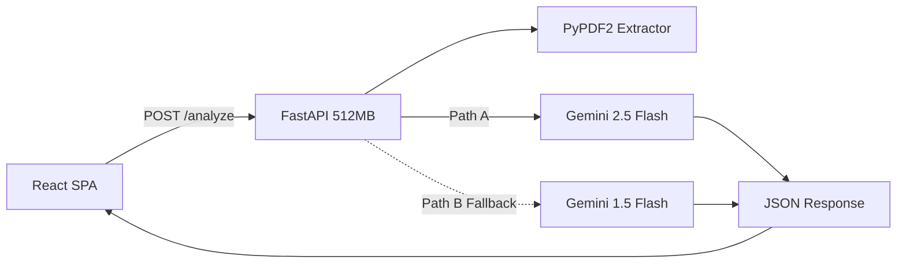
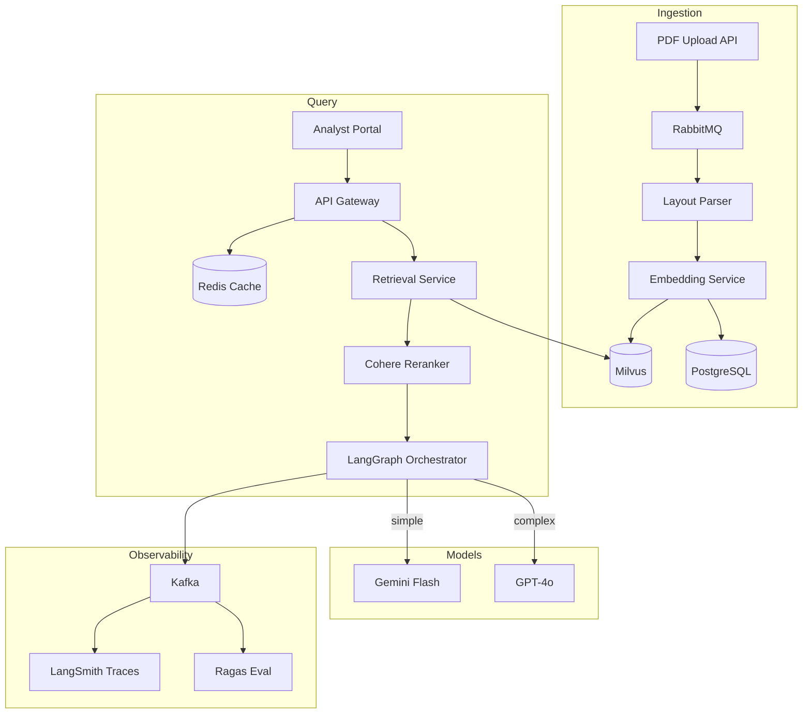

# 📊 10-K Intelligence Parser

> AI-powered SEC 10-K filing analysis tool for institutional investors. Upload any company's annual report — get instant compliance audits, risk analysis, and executive briefs in English, Simplified Chinese, or Traditional Chinese.

**Live Demo:** [JL Intelligence](https://jl-intelligence.netlify.app/) · **Tech Stack:** React · Tailwind CSS · FastAPI · Google Gemini

---

## 🔹 Current Architecture (Prototype)

The prototype is designed for rapid demo deployment on a constrained 512MB RAM server.

```
Frontend (index.html)          Backend (main.py)              External
┌─────────────────────┐       ┌──────────────────────┐       ┌──────────┐
│ React + Tailwind CSS│──POST─│ FastAPI              │──API──│ Gemini   │
│ - PDF Upload        │ /analyze│ - PyPDF2 extraction │       │ 2.5 Flash│
│ - 3 Analysis Modes  │       │ - Language routing   │       │ (or 1.5) │
│ - EN/ZH-CN/ZH-HK   │       │ - gc.collect() RAM   │       └──────────┘
│ - Markdown render   │◄─JSON─│ - 25k char truncation│
└─────────────────────┘       └──────────────────────┘
```

### How It Works

1. **Frontend**: Single-page React app. User uploads a PDF and selects an analysis type:
   - 📋 **Comprehensive** — Deep institutional research report
   - 🔍 **Compliance** — Risk disclosure audit with red flags
   - ⚡ **Quick Brief** — 3-minute executive summary
2. **Backend**: FastAPI with a single `/analyze` endpoint. PyPDF2 extracts text from the **first 10 pages** only (RAM constraint). Text is truncated to 25,000 characters.
3. **LLM Routing**: Dual-path failover — tries Gemini 2.5 Flash Interactions API first, falls back to Gemini 1.5 Flash if the newer API is unavailable.
4. **Limitations**: No vector database, no semantic chunking, no caching, no evaluation pipeline. Cannot cross-reference data across the full 200+ page filing.

### Current Architecture Diagram



---

## 🔹 Who Uses This and Why

### What is a 10-K?

A **200–300 page annual report** that every US public company must file with the SEC. It covers revenue, risk factors, lawsuits, debt obligations, management strategy, and more. Think of it as a company's **full medical checkup report** — except it's written by lawyers.

### Who are "institutional analysts"?

Professional investors at firms like **China AMC (华夏基金)**, Fidelity, or Goldman Sachs who manage billions of dollars. They read **hundreds** of these reports per year. They don't read 10-Ks for fun — they read them because they **must**, and they need answers fast.

### What do they actually search for?

| Role | What They Do (Plain English) | What They Search For | Example Keywords |
|:---|:---|:---|:---|
| **Buy-Side Researcher** | "Should we buy this stock?" — compares promises vs reality | Revenue growth vs last year's guidance | `revenue`, `guidance`, `outlook`, `YoY growth` |
| **Risk Analyst** | "What could go wrong?" — finds hidden dangers | All sentences mentioning potential threats | `risk factor`, `China`, `tariff`, `supply chain`, `litigation` |
| **Compliance Officer** | "Is this company being honest?" — checks rule compliance | Auditor red flags, financial restatements | `restatement`, `going concern`, `material weakness`, `SOX` |
| **Portfolio Manager** | "Give me the TL;DR in 3 minutes" — speed over depth | Key financial numbers only | `EPS`, `capex`, `buyback`, `dividend`, `forward guidance` |
| **Credit Analyst** | "Can this company pay its debts?" — checks financial health | Debt schedules, loan covenants | `maturity`, `covenant`, `interest coverage`, `credit facility` |
| **ESG Analyst** | "Is this company hurting the planet or people?" — sustainability | Environmental lawsuits, diversity data | `carbon`, `emissions`, `diversity`, `environmental litigation`, `SASB` |

### Why can't they just Ctrl+F?

1. **Scale**: 200+ pages per filing × dozens of companies per analyst
2. **Scattered data**: Revenue in Item 7, risk in Item 1A, debt in Item 8 notes — all cross-referenced
3. **Tables**: Financial tables need to be parsed structurally, not as raw text
4. **Audit trail**: Analysts need **citations with exact page numbers** — "Revenue increased 8% YoY (10-K p.47, para 3)" — or their compliance team rejects the analysis

---

## 🔹 Production Architecture (Ideal Design)

**Target Scale:** 100 PDFs/day · 100MB each · Institutional-grade compliance

### Ingestion Pipeline (Async — processes PDFs in background)

1. **PDF Upload** → Celery Task Queue (RabbitMQ broker)
2. **Layout Parser** (Docling/Unstructured) → structure-aware chunking that preserves tables, footnotes, and section headers
3. **Embedding** → `text-embedding-3-large` (1536-dim) → Milvus HNSW Index
4. **Metadata tagging**: `company_ticker`, `fiscal_year`, `section_id`, `page_number`

### Query Pipeline (Sync — answers analyst questions in real-time)

1. **Analyst query** → FastAPI Gateway → Redis Semantic Cache (cosine > 0.95 = cache hit, <50ms)
2. **Cache miss** → Milvus hybrid search (dense + BM25) → top-20 candidate chunks
3. **Cohere Reranker** → top-5 chunks with page citations
4. **LangGraph State Machine**: Router Agent → Retrieval Agent → Auditor Agent (cross-reference validation loop)
5. **Model Cascade**: simple queries → Gemini Flash ($); complex cross-references → GPT-4o ($$$)
6. **Response**: `"Revenue increased 8% YoY (10-K p.47, para 3)"`

### Why LangGraph Instead of Direct Milvus Search?

Direct vector search works for **simple single-hop queries** like *"What was AAPL's 2024 revenue?"* — one search, one answer.

But institutional analysts ask **multi-hop questions** that require cross-referencing across sections:

> *"Compare AAPL's revenue growth over the past 3 years against management's forward guidance. Did they deliver on their promises?"*

This requires:
1. **Router Agent** — classifies this as a multi-hop query (not a simple factoid)
2. **Retrieval Agent (Pass 1)** — searches Milvus for Item 7 (MD&A) guidance paragraphs
3. **Retrieval Agent (Pass 2)** — searches Milvus again for Item 8 revenue tables (3 years)
4. **Auditor Agent** — cross-references the numbers, checks footnotes for restatements
5. **Loop back** if validation fails — retrieves additional context until numbers are consistent

```
Simple RAG:     Query → Milvus → LLM → Answer (one shot, hope for the best)

LangGraph:      Query → Router → Retriever → Auditor ──┐
                                     ↑                  │
                                     └── validation fail ┘
                                          ↓ pass
                                        Answer (with page citations)
```

The Auditor loop is what pushes our **Faithfulness score above 0.90** — it catches hallucinated numbers before they reach the analyst.

### Evaluation & Monitoring

- **Ragas**: Faithfulness > 0.90, Context Recall > 0.85, Answer Relevancy > 0.80
- **Gold Dataset**: 100 manually verified analyst Q&A pairs for regression testing
- **G-Eval gate**: Blocks deployment if quality scores drop below thresholds
- **Token cost**: Target <$0.15/query average

### Production Architecture Diagram



---

## 🔹 Technical Decisions: Current → Production

| Decision | Current Prototype | Production Target | Why |
|:---|:---|:---|:---|
| **PDF Parsing** | PyPDF2 (text-only, first 10 pages) | Docling (layout-aware, full document) | Preserves table structure and footnotes |
| **Chunking** | 25k char truncation | Semantic structure-based (parent-child) | Tables stay intact, section context preserved |
| **Vector DB** | None | Milvus HNSW (self-hosted) | Data sovereignty for institutional clients |
| **Caching** | None | Redis semantic cache (cosine > 0.95) | 60% token savings, <50ms for repeat queries |
| **Orchestration** | None (single LLM call) | LangGraph multi-agent with Auditor loop | Multi-hop queries + hallucination prevention |
| **LLM** | Single Gemini call | Model cascade (Flash → Pro) | 70% cost reduction on simple queries |
| **Evaluation** | None | Ragas + G-Eval Gold Dataset | Faithfulness regression gate on every deploy |
| **Scaling** | Single 512MB server | K8s EKS + KEDA auto-scale | Handle 100 concurrent PDF uploads |

---

## 🚀 Quick Start

```bash
# Clone
git clone https://github.com/joe-ging/AI_Stock_Analyst.git
cd AI_Stock_Analyst

# Install dependencies
pip install -r requirements.txt

# Set your Gemini API key
export GEMINI_API_KEY="your-key-here"

# Run
python main.py
# Server starts at http://localhost:10000
```

Open `index.html` in your browser, upload a 10-K PDF, and select your analysis type.

---

## 📄 License

MIT
