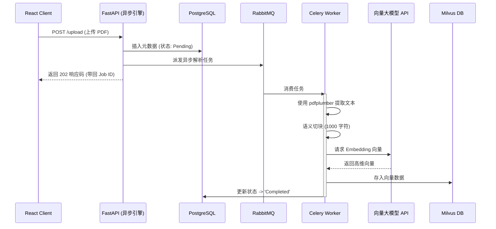
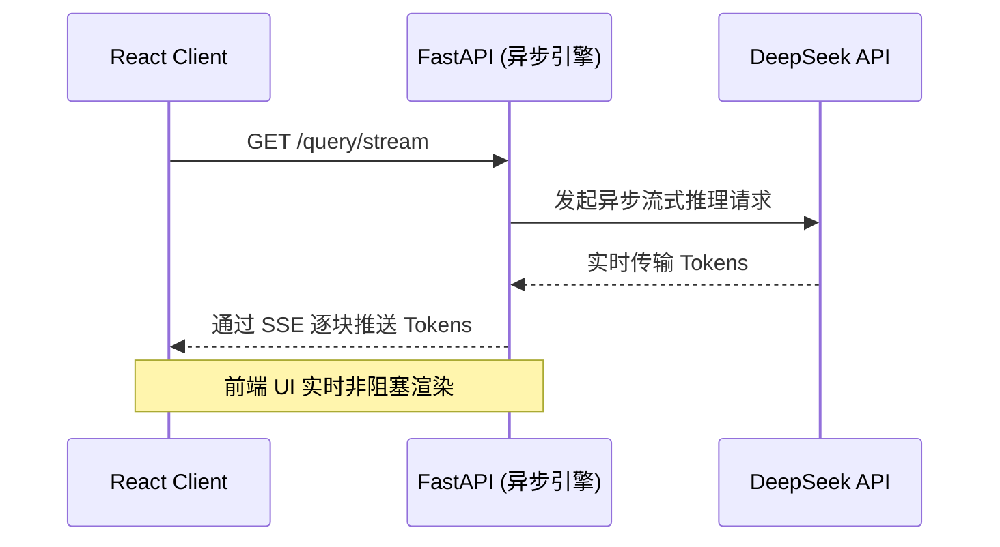
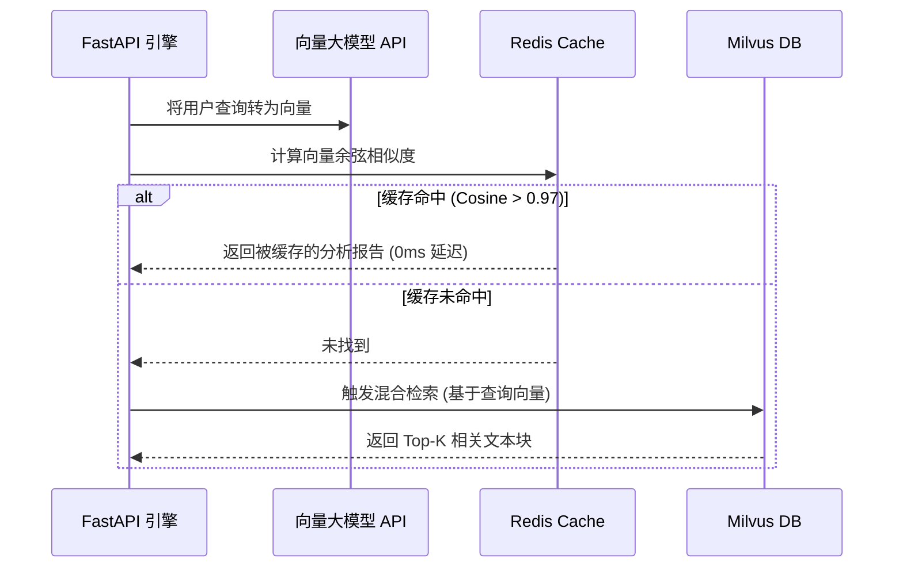

<div align="right">
  <a href="README.md"></a>
  <a href="README_zh.md"></a>
</div>

# 📊 JL Intelligence - 企业级 AI 投研平台 (微服务架构)

> 专为机构投资者打造的 AI 驱动的 SEC 财报分析工具。基于生产级微服务架构构建，全面强调 **100% 异步并发处理**、多模态数据库协同优化，以及严格的 Ragas 事实客观审计。

**在线演示：** [JL Intelligence](https://jl-intelligence.netlify.app/)
**核心技术栈：** React · FastAPI · Milvus · Redis · Celery/RabbitMQ · DeepSeek / Gemini

---

## 🔹 1. 企业级微服务架构与技术栈

本系统完全解耦为多个专业微服务，彻底消除了单体架构的性能瓶颈。所有的 I/O 操作（从文档解析到大模型流式输出）均被设计为**完全异步 (Asynchronous)**，以实现最大化的系统并发能力。

### 核心技术栈：
- **API 网关与核心引擎**: FastAPI (Python 3.10) - 全面采用 `async`/`await` 实现非阻塞 I/O。
- **文档解析策略**: 我们曾评估过重型的 OCR AI 模型 (如 **Docling**)，但最终否决了它们，因为其速度极其缓慢、模型体积过于庞大，且消耗了灾难性的 CPU/RAM 资源。取而代之的是，我们坚定选择了 **`pdfplumber`**，它在提取 SEC 财报表格和版面时，展现了闪电般的速度与极低的资源开销，同时保持了极高的精确度。
- **消息中间件与后台任务**: RabbitMQ & Celery (用于分发解析任务)。
- **数据库组件**:
  - **PostgreSQL**: 关系型元数据存储与文档处理状态追踪。
  - **Milvus (单机版)**: 高维向量存储。
  - **Redis**: 内存级语义检索缓存与任务队列状态管理。
- **AI 大模型与编排层 (解耦式智能架构)**: 
  根据代码库的真实实现，我们巧妙地将 AI 负载解耦为两个截然不同的阶段，针对不同任务分配了最优的大模型组合：
  
  1. **第一阶段：语义提取与向量化 (用户查询 & SEC 财报数据)**
     - *核心职责*: 该阶段负责在数据摄取时将大量 SEC 文档文本块转化为密集向量，并在混合搜索期间对用户的提问进行向量化。
     - *首选模型*: **OpenAINext (`text-embedding-3-small`)**。选择它是因为其具有业界领先的**1536维**超高语义输出。相比于 Gemini 的 768 维输出，OpenAINext 的高维度能提供指数级增长的颗粒度，显著提升了混合检索的绝对精度。(注意：由于 DeepSeek 原生不支持向量提取接口，因此在本阶段不被使用)。
     - *容灾降级模型*: **Gemini Embeddings** (768维)。一旦 OpenAINext API 遭遇限流或服务宕机，系统将无缝切换至 Gemini 向量模型，确保数据解析 0 中断。
  
  2. **第二阶段：内容生成与逻辑推理 (Inference)**
     - *核心职责*: 在从 Milvus 向量数据库检索到最相关的上下文后，该阶段负责综合分析这些数据，并将最终的投研报告流式传输给用户。
     - *首选模型*: **DeepSeek-Chat**。之所以在生成端选用它，是因为 DeepSeek 在处理重度逻辑推理时速度极快且成本极低；相比之下，Gemini 不仅 API 调用极为昂贵，在香港地区封锁严重，且整体延迟表现不佳。
     - *容灾降级模型*: **Gemini 2.5 Pro**。如果 DeepSeek 官方接口崩溃 (HTTP 500) 或触发限流 (HTTP 429)，大模型瀑布流降级机制 (LLM Cascade) 将动态接管流式请求，瞬间切换至 Gemini 保证系统高可用。

  - **大模型编排**: 采用 LangChain 风格的纯自研异步流水线。允许实现复杂的循环路由机制，专为 Ragas 客观审计器设计。

---

## 🔹 2. 全异步数据流水线 (极速并发体验)

为了应对海量的企业级计算负载，系统的**输入端 (数据接入)** 和 **输出端 (推理生成)** 流水线均是完全异步的。

### 2.1 异步输入端：文档解析与向量化数据流
当用户上传一份高达 200 页的 SEC 10-K 财报时，API 绝对不会阻塞。它仅仅在 PostgreSQL 中注册任务状态，随后将繁重的向量化工作通过 RabbitMQ 委派给后台的 Celery Worker 集群。



### 2.2 异步输出端：大模型流式推理流
用户无需面对白屏死等 30 秒以获取完整的投研报告。引擎巧妙利用了 Python 的异步生成器 (`async yield`)，通过 **SSE (Server-Sent Events)** 技术，像打字机一样将生成的 Token 实时推送到前端 React 界面。



---

## 🔹 3. 高可用性、自动降级与多云网络架构

### 微服务监控与大模型级联容灾 (LLM Cascade)
微服务之间互相保持监听与健康检查。如果主节点 `DeepSeek-Chat` 接口遭遇官方限流 (HTTP 429) 或服务崩溃，系统将自动触发**大模型瀑布流降级 (LLM Cascade)**，顺滑切换至 `Gemini 2.5 Flash / Pro`。
- **为何选择 Gemini 作为备胎？** Gemini 在成本效益与高并发吞吐量之间取得了极佳的平衡，这保证了在服务端遇到突发异常时，系统能在不引爆紧急 API 账单的前提下，维持极高的 RPO/RTO 弹性恢复能力。

### 多云网络优化与去除代理层 (TCO 演进策略)
由于 Gemini API 在香港存在严苛的区域网络封锁，最初的架构不得不依赖脆弱的 SOCKS5 代理隧道，将所有大模型请求强制路由至 AWS 悉尼代理机，这极大地增加了整体延迟与不稳定因子。
- **解决方案：** 作为后续的架构优化，系统将无状态的 `engine` 和 `gateway` 容器彻底跨云迁移至原生支持 Gemini 的 AWS 悉尼环境。这不但彻底消除了代理层的网络开销，更让 API 调用延迟直接降低了 **50%** 以上。

---

## 🔹 4. 数据库架构设计 (组件优化与协同)

我们摒弃了用单一庞大数据库处理所有负载的传统模式，转而采用专库专用的组合架构，确保特定的性能瓶颈被最合适的数据库解决：

| 组件 | 技术栈 | 核心职责 | 选型理由 (对比替代方案) | 深度优化策略 |
| :--- | :--- | :--- | :--- | :--- |
| **关系型元数据** | **PostgreSQL** | 存储文档元数据、文本块映射与任务处理状态。 | 相比 NoSQL (如 MongoDB)，在追踪文档流转状态时，我们需要极其严格的 ACID 事务保证。 | 部署 **PgBouncer** 防连接耗尽；通过 `EXPLAIN ANALYZE` 验证 B-Tree 索引。 |
| **向量存储** | **Milvus** (单机版) | 专职存储与检索被切分的文档密集向量。 | 相比 PostgreSQL 的 `pgvector` 插件，Milvus 在面对数以百万计的高维向量时，水平扩展能力更强，原生支持 ANN (HNSW) 索引。 | 部署在私有子网中，与关系型数据库分离，可独立进行算力缩放。 |
| **内存级缓存** | **Redis** | 语义检索拦截层与 Celery 消息队列后台。 | 相比 Memcached，Redis 具备数据持久化能力，且原生支持 Celery 所需的复杂数据结构。 | 拦截查询并计算余弦相似度。缓存命中 (>0.97) 时彻底绕过大模型层，实现 0ms 闪电响应。 |



---

## 🔹 5. 基于 Ragas 框架的客观事实审计 (杜绝幻觉)

在严肃的金融领域，AI 幻觉是绝对不可接受的。当异步大模型流式输出完成后，系统会在后台启动一项基于 **Ragas (Retrieval Augmented Generation Assessment)** 的严格审计流程。Ragas 是业内专门用于评估 RAG 系统质量的开源标准框架。

Ragas 审计器充当了一个绝对理性的“法官”，它会逐句对比大模型生成的草稿与底层 Milvus 检索出的原始 SEC 财报文本块。

```mermaid
graph TD
    A[已生成投研报告草稿] --> B[Ragas 核心审计引擎]
    C[(从 Milvus 检索出的原始 SEC 文本块)] --> B
    
    B --> D{评估忠诚度 (Faithfulness)}
    D -->|包含未被证实的伪造数据| E[拒绝通过 / 标记幻觉风险]
    D -->|100% 源自客观文本块| F{评估相关性 (Relevance)}
    
    F -->|相关性低/答非所问| G[拒绝通过 / 触发重试]
    F -->|高相关性| H[审计通过并自动附加引文出处]
    
    H --> I[最终版机构级投研报告]
```

---

## 🔹 6. 零宕机 DevOps 交付体系

整套系统运行在容器化环境中，依托自动化的 CI/CD 流水线进行部署。

- **GitOps 与自动化部署**: 
  1. 开发者将代码 `git push` 至 `main` 主分支。
  2. **GitHub Actions** 自动触发 `pytest` 端到端测试，以验证 RAG 检索逻辑的正确性。
  3. 测试通过后，流水线会自动构建 Docker 镜像，并推送到**腾讯云容器镜像仓库 (TCR)** 或 Docker Hub。
  4. 远程生产服务器自动拉取最新镜像并执行部署脚本。
- **零宕机热重载**: 自研的 `deploy.sh` 脚本在部署更新时实施“滚动升级”，专门指定更新无状态的计算节点（`gateway`，`engine`），并小心翼翼地绕过有状态的数据卷（`postgres`，`milvus`，`redis`），在不丢失任何一条历史记录的前提下完成了敏捷迭代。

---

## 🔹 7. 安全与密钥管理 (Secret Management)

企业级金融应用对密钥管理有极其严苛的要求。API 密钥 (Gemini, DeepSeek, OpenAINext) 和数据库凭证**绝对禁止**硬编码在代码库中。

| 运行环境 | 密钥管理策略 (Secret Management Strategy) |
| :--- | :--- |
| **本地开发环境** | 通过本地的 `.env` 文件注入环境变量 (已被 `.gitignore` 忽略，防泄露)。 |
| **CI/CD 流水线** | 在 GitHub Actions 执行期间，通过 **GitHub Secrets** 进行安全托管与注入。 |
| **生产环境** | 生产环境密钥由云厂商的 KMS (密钥管理服务) 统一托管，或在腾讯云/AWS 容器运行时作为加密环境变量安全注入。 |

---

## 🚀 快速启动 (本地 Docker 部署)

> [!IMPORTANT]
> 本代码库为企业级私有仓库。在尝试克隆之前，请确保你已经向管理员申请并获取了仓库访问权限。

```bash
# 克隆私有代码库 (需要配置 SSH 密钥或 PAT 令牌)
git clone git@github.com:joe-ging/AI_Stock_Analyst_Enterprise.git
cd AI_Stock_Analyst_Enterprise

# 创建并配置本地加密环境变量文件
touch .env
echo "GEMINI_API_KEY=your_key_here" >> .env
echo "DEEPSEEK_API_KEY=your_key_here" >> .env
echo "OPENAINEXT_API_KEY=your_key_here" >> .env

# 一键启动全套微服务集群
docker-compose up -d --build

# 实时查看核心引擎与 worker 日志
docker-compose logs -f engine worker
```

**访问前端应用：** 浏览器打开 `http://localhost:8000/index.html`
