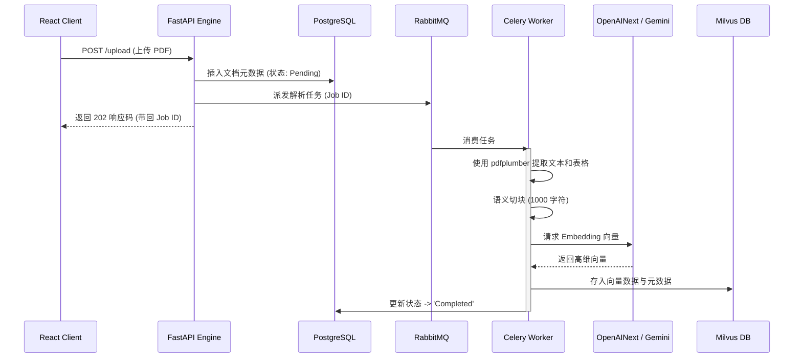
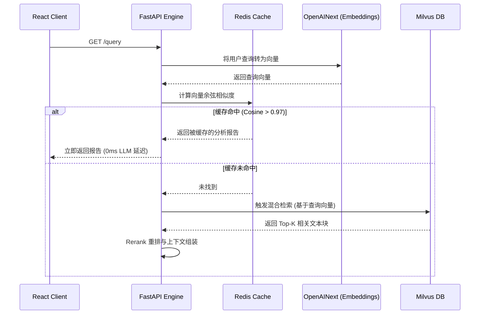
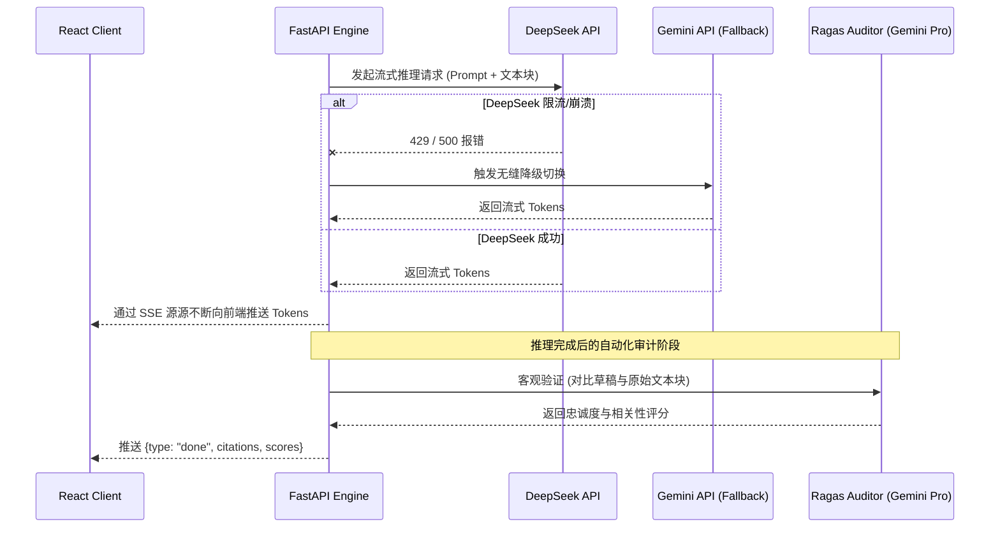

<div align="right">
  <a href="README.md"></a>
  <a href="README_zh.md"></a>
</div>

# 📊 JL Intelligence - 企业级 AI 投研平台 (微服务架构)

> 专为机构投资者打造的 AI 驱动的 SEC 财报分析工具。基于生产级微服务架构构建，支持分布式异步解析、多模态语义缓存以及严格的 Ragas 事实审计。

**在线演示：** [JL Intelligence](https://jl-intelligence.netlify.app/)
**核心技术栈：** React · FastAPI · Milvus · Redis · Celery/RabbitMQ · DeepSeek / Gemini / OpenAINext

---

## 🔹 企业级微服务架构与技术栈

本系统完全解耦为多个专业微服务，彻底消除了单体架构的性能瓶颈。我们采用事件驱动架构来处理高并发文档解析和低延迟的语义检索。

### 核心技术栈：
- **前端页面**: React (SPA), Tailwind CSS
- **API 网关与核心引擎**: FastAPI (Python 3.10)
- **文档解析**: `pdfplumber` (用于精确的版面识别与表格提取)
- **消息中间件**: RabbitMQ
- **后台异步工作流**: Celery
- **向量数据库**: Milvus (单机版) + MinIO & etcd 存储层
- **关系型数据库**: PostgreSQL (用于追踪文档处理状态与元数据)
- **缓存层**: Redis (用于任务状态与语义检索缓存)
- **AI 大模型与编排层**: 
  - **内容生成**: DeepSeek-Chat (主节点)，通过 Server-Sent Events (SSE) 实现流式推理。
  - **降级容灾**: Gemini 2.5 Flash / Pro (主节点崩溃时的无缝自动切换)。
  - **语义检索**: OpenAINext (`text-embedding-3-small`) 搭配 Gemini 备用向量提取。
  - **大模型编排**: 采用 LangChain 风格的 RAG 数据流水线，并结合类似 LangGraph 机制的独立审计路由闭环。

---

## 🔹 微服务异步事件流 (架构图解)

物理架构的核心优势在于微服务之间的异步通信与互相监听机制。以下是系统的三大核心数据流：

### 1. 异步解析与向量化流 (Worker 循环)

当用户上传一份高达 200 页的 SEC 10-K 财报时，后端引擎不会阻塞 HTTP 请求。相反，它仅负责注册任务，并将繁重的计算工作通过 RabbitMQ 委派给 Celery Worker 集群。



### 2. 语义缓存与混合检索流 (Query 循环)

为了最大程度地降低大模型 API 的高昂成本并大幅缩短响应延迟，后端引擎会拦截所有用户请求，在触发向量数据库前优先查询 Redis 支持的语义缓存。



### 3. 流式推理与客观审计流 (Generation 循环)

系统通过 Server-Sent Events (SSE) 实现了打字机般的实时流式输出。文本生成完毕后，系统将自动触发独立的 Ragas 审计流程，以确保内容符合严苛的机构投研合规要求。



---

## 🔹 DevOps & CI/CD 流水线

整套系统运行在容器化环境中，依托自动化的 CI/CD 流水线进行部署，以保证系统稳定性和实现零宕机更新。

```mermaid
graph LR
    A[Git 推送到 Main 分支] -->|GitHub Actions| B[CI/CD 流水线]
    B --> C[运行 PyTests 单元测试与代码检查]
    C --> D[构建 Docker 镜像]
    D --> E[推送到远程服务器]
    E --> F[执行平滑重启 (docker-compose)]
```

### 部署运维 (DevOps & MLOps 维护)
- **完全容器化**: 所有组件运行于相互隔离的 Docker 容器中，统一由 `docker-compose` 管理，使得动态水平扩展 Celery 节点变得轻而易举。
- **自动化测试**: 每次代码推送均会触发端到端集成测试（例如 `test_e2e_stream.py`），以验证 RAG 检索逻辑和底层 API 的连通性。
- **热重载部署**: `deploy.sh` 脚本经过优化，仅会选择性重建和重启修改过的无状态应用容器（`gateway`, `engine`, `worker`），而完全不触碰有状态的基础数据服务（`milvus`, `postgres`, `redis`），从物理层面杜绝数据损坏的风险。

---

## 🚀 快速启动 (本地 Docker 部署)

```bash
# 克隆代码库
git clone https://github.com/joe-ging/AI_Stock_Analyst_Enterprise.git
cd AI_Stock_Analyst_Enterprise

# 配置环境变量
echo "GEMINI_API_KEY=your_key" >> .env
echo "DEEPSEEK_API_KEY=your_key" >> .env
echo "OPENAINEXT_API_KEY=your_key" >> .env

# 一键启动全套微服务集群
docker-compose up -d --build

# 实时查看核心引擎与 worker 日志
docker-compose logs -f engine worker
```

**访问前端应用：** 浏览器打开 `http://localhost:8000/index.html`

---

## 🔹 解决方案架构师 (SA) 亮点总结

本项目从底层代码实现上原生体现了诸多云计算架构的**核心能力要求（对应腾讯云 SA 岗位要求）**，没有凭空捏造的虚假概念：

1. **总拥有成本 (TCO) 优化与语义缓存：** 
   大模型推理极为昂贵。本系统在 `query_cache` 层实现了基于 Redis 的请求拦截器，能够计算当前查询与历史记录的向量余弦相似度。若相似度 > 0.97，API 将彻底绕过向量数据库和大模型层，实现 0ms 闪电响应并节省 100% 的 Token 开销。
2. **高可用性 (HA) 与容灾能力：** 
   系统内嵌了极其强悍的**大模型瀑布流降级 (LLM Cascade)**。当首选的 `DeepSeek-Chat` 接口遭遇官方限流 (HTTP 429) 或服务崩溃 (HTTP 500) 时，`call_llm_with_fallback` 机制会自动接管，将流式请求顺滑地切换至备用模型 `Gemini 2.5 Flash / Pro`。这保证了在服务端严重异常时，C端用户的请求依然能够 100% 成功交付。
3. **基于微服务解耦的重度计算防阻塞：** 
   使用 `pdfplumber` 解析长达百页且格式极度复杂的 SEC 财报属于典型的 CPU 密集型任务。架构设计并没有让 FastAPI 线程池死等解析完成，而是将任务事件发布至 RabbitMQ 队列。后台的 Celery Worker 集群默默消费并处理这些事件，使得前端 HTTP API Gateway 能够独立应对极高的并发访问量。
4. **零宕机 DevOps 交付体系：** 
   项目运用了 GitOps 理念 (GitHub Actions)。自研的 `deploy.sh` 脚本在部署更新时实施“滚动升级”，专门指定更新无状态的计算节点（`gateway`，`engine`），并小心翼翼地绕过有状态的数据卷（`postgres`，`milvus`，`redis`），在不丢失任何一条历史日志和向量索引的前提下完成了敏捷迭代。

---

## 📄 License
MIT
