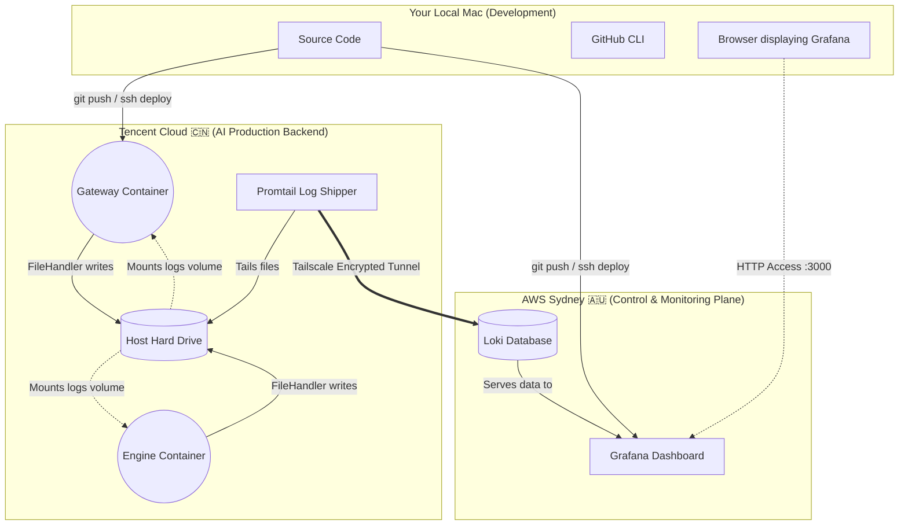

# 🗺️ Global Log Architecture & Storage Map

To answer your question: **"Where are these log files? Why aren't they on my local machine?"** 

The short answer is: The log files are **generated and stored dynamically on your remote servers during runtime**. They are not part of your local source code, because bringing gigabytes of server logs back to your laptop via GitHub would crash your local environment.

Here is the precise map of where everything lives across your three environments:

## Detailed File Locations

### 1. Tencent Cloud (Data Generator)
This is where the actual Python code executes and generates the physical text files.
- **Physical Path on Server**: `/home/ubuntu/AI_Stock_Analyst_Enterprise/logs/`
- **Files**: `gateway.log`, `engine.log`
- **Why it's here**: Docker `volumes` map the container's internal `/app/logs` directory directly to this physical path on the Tencent Cloud hard drive. Even if the container is destroyed, the logs remain safe here.

### 2. AWS Sydney (Data Vault)
This is where the logs are aggregated and indexed so you can search them at lightning speed.
- **Physical Path on Server**: Hidden inside the `loki` docker volume.
- **Why it's here**: Promtail (on Tencent) reads the text files line-by-line and streams them over the Tailscale VPN to Loki (on Sydney). Loki compresses and indexes them.

### 3. Your Local Mac (Source Code Only)
- **Path**: `/Users/jingsmacbookpro/.gemini/antigravity/playground/AI_Stock_Analyst_Enterprise/logs/` (Might be empty or only contain local test logs)
- **Why they don't match**: Your local machine is for **writing code**. The servers are for **running code**. The `gateway.log` you see in Grafana contains the real-world traffic hitting your Tencent Cloud public IP, which obviously never touches your local laptop's hard drive!
