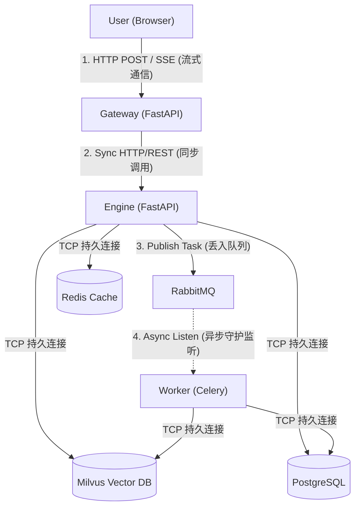

# 🏢 微服务间通信与监听机制 (Microservices Communication)

在企业级架构中，微服务之间并不是简单的“前端调后端 API”。为了实现高并发、高可用和彻底的解耦，我们混合使用了 **同步 HTTP/REST** 和 **异步消息队列 (AMQP)** 两种监听机制。

目前咱们的系统包含 **7 个核心微服务/组件**：
1. **Gateway (网关)**: 负责处理前端并发连接与流式输出。
2. **Engine (核心引擎)**: 负责 RAG 检索和 LLM 对接。
3. **Worker (异步节点)**: 负责极其耗时的 PDF 解析和向量化。
4. **RabbitMQ**: 消息总线。
5. **PostgreSQL**: 关系型数据库。
6. **Milvus**: 向量数据库。
7. **Redis**: 高速缓存。

### 📊 微服务通信拓扑图 (Communication Topology)



---

## 1. Gateway 与 Engine 的通信：同步 HTTP (Synchronous REST)

这是最经典的“API 调 API”模式。Gateway 收到前端请求后，作为“代理”去调用 Engine 的接口。
它们在 Docker 内部网络中通过 `http://engine:8001` 进行通信。

**代码片段：Gateway 是如何呼叫 Engine 的 (`gateway/main.py`)**
```python
@app.post("/analyze/stream")
async def analyze_document_stream(file: UploadFile = File(None), ...):
    # Gateway 发起对 Engine 的 HTTP POST 请求
    async with httpx.AsyncClient(timeout=600.0, trust_env=False) as client:
        # 使用流式客户端实时监听 Engine 返回的数据包 (Tokens)
        async with client.stream("POST", f"{ENGINE_URL}/query/stream", data=query_data) as resp:
            async for line in resp.aiter_lines():
                if line:
                    yield f"{line}\n\n" # 再推给前端
```

---

## 2. Engine 与 Worker 的通信：异步消息队列监听 (Asynchronous AMQP)

这是企业级架构的精髓！**Engine 绝对不能同步调用 Worker**，因为处理一个几百页的 PDF 可能需要 3 分钟。如果同步调用，HTTP 连接会直接超时崩溃。

所以，Engine 不会直接“调” Worker 的 API。Engine 只负责把任务（Message）扔进 **RabbitMQ**，然后立刻返回给用户“任务已受理”。
而 **Celery Worker** 则作为一个守护进程（Daemon），永远在后台默默“监听（Listen）” RabbitMQ 里的消息。

**代码片段 A：Engine 把任务扔进 RabbitMQ (`engine/main.py`)**
```python
@app.post("/ingest")
async def ingest_document(file: UploadFile = File(...)):
    # 1. 存入数据库标记为 Pending
    job_id = str(uuid.uuid4())
    # ...
    
    # 2. 扔进队列 (delay 方法代表不等待结果，直接异步派发)
    # 这句话执行只需 0.001 秒，任务进入 RabbitMQ
    process_document_task.delay(job_id, filepath)
    
    # 3. 立即返回前端，连接断开
    return {"status": "processing", "job_id": job_id}
```

**代码片段 B：Worker 如何“监听”并执行任务 (`engine/tasks.py`)**
```python
# 初始化 Celery，绑定到 RabbitMQ (Broker)
celery_app = Celery("tasks", broker=CELERY_BROKER_URL, backend=CELERY_RESULT_BACKEND)

# 这个装饰器告诉 Worker：死死盯住 RabbitMQ 里名为 process_document_task 的信道！
@celery_app.task(bind=True)
def process_document_task(self, job_id, filepath):
    # 一旦 RabbitMQ 收到 Engine 扔过来的消息，Worker 就会被唤醒并执行这里的代码
    try:
        # 1. 解析 PDF
        # 2. 存入 Milvus
        # 3. 更新 PostgreSQL 状态为 Completed
    except Exception as e:
        # 失败处理
```

---

## 3. 微服务与数据库的通信：TCP 长连接 (TCP Persistent Connections)

像 Redis, Milvus, PostgreSQL 并不是传统的 Web API（不走 HTTP 协议）。它们走的是底层的 TCP 协议，为了保证速度，服务启动时会建立一个持久的连接池（Connection Pool），避免每次都握手。

**代码片段：TCP 连接初始化 (`engine/main.py`)**
```python
# 启动时建立一条通往 Milvus 的持久监听通道
connections.connect("default", host=MILVUS_HOST, port=MILVUS_PORT)
```

## 总结
这套架构的强悍之处在于 **Gateway -> Engine (同步) -> MQ -> Worker (异步)** 的分层设计。当前端需要实时对话时走同步流式，当需要重度计算时走异步队列，互不干扰！
